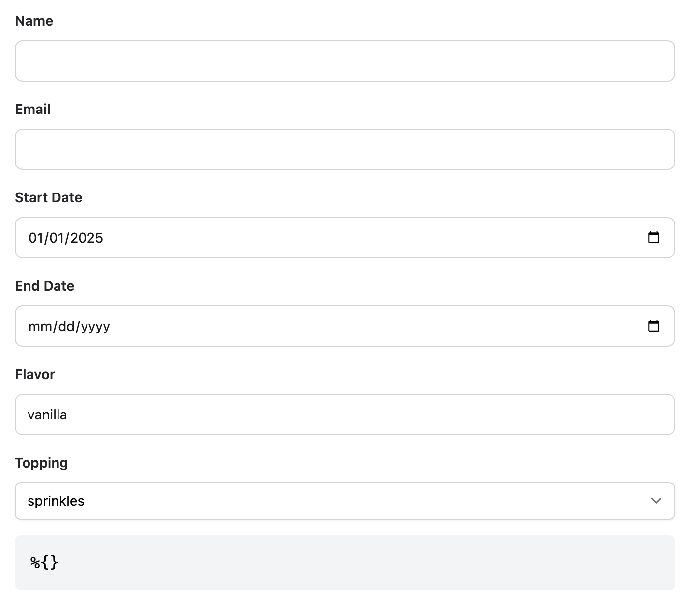
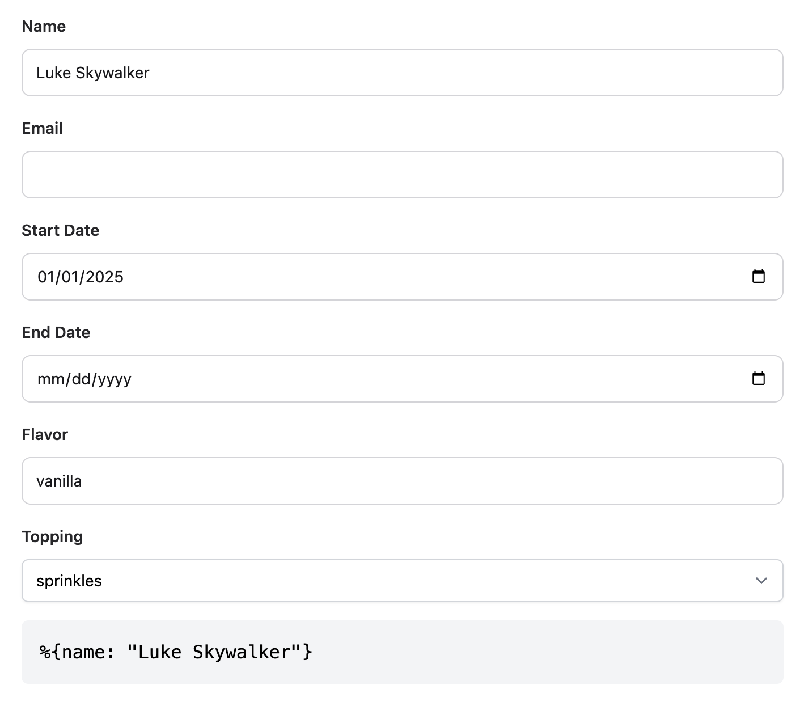
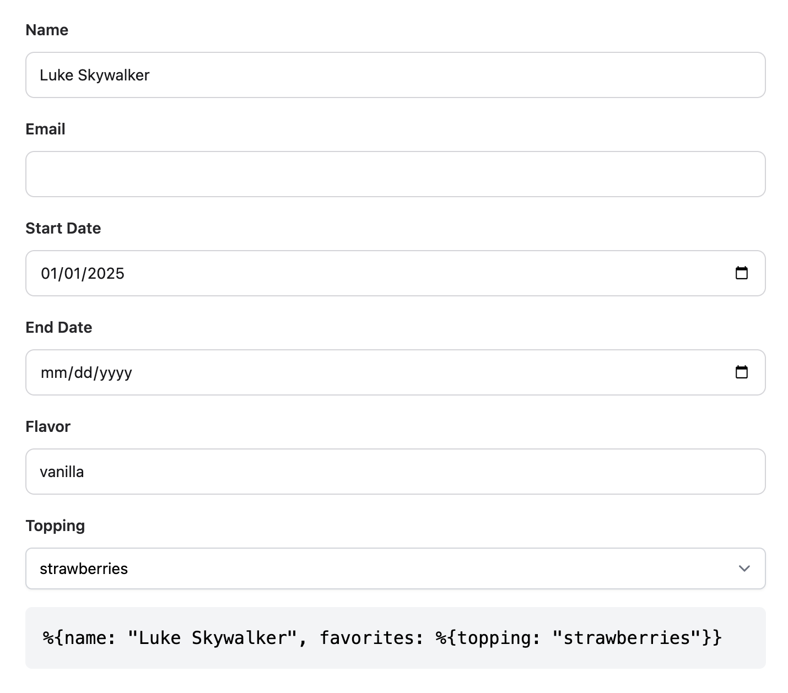

# Pram

To start your Phoenix server:

  * Run `mix setup` to install and setup dependencies
  * Start Phoenix endpoint with `mix phx.server` or inside IEx with `iex -S mix phx.server`

Now visit [`localhost:4000/pram`](http://localhost:4000/pram) from your browser.

## Changed Parameters

Open [`lib/pram_web/live/pram_live/index.ex`](./lib/pram_web/live/pram_live/index.ex) to get started.

Note that by default, the URL has no query string, and the displayed params are empty `%{}`. Before
the user provides input, the parameters all contain their default values, so there's no need to encode
anything in the URL.



Once the user has provided input, only the field(s) that have changed are recorded in the URL.



Changing additional fields will include them in the URL, so long as their value is different from the
default.



## Implementation

```elixir
defmodule PramWeb.PramLive.Index do
  # ..(snip)..

  # 1. Define the default parameters. Only values that differ
  # from the default are included in the URL.
  defp default_params do
    %Params{
      date_filter: %Params.DateFilter{},
      favorites: %Favorites{}
    }
  end

  # 2. No need to do anything special in `mount`.
  @impl true
  def mount(_params, _session, socket) do
    {:ok, socket}
  end

  # 3. The URL parameters only include values that differ from the defaults.
  # To get the full parameters, we need to merge the URL parameters with the
  # default parameters.
  @impl true
  def handle_params(params, _uri, socket) do
    params = Params.changeset(default_params(), params)
    {:noreply, assign(socket, :params, params)}
  end

  # 4. When the parameters change, we need to update the URL.
  # We do this by calling `push_patch/3` with *only* the changed parameters.
  @impl true
  def handle_event("update_params", %{"params" => params}, socket) do
    default_params()
    |> Params.changeset(params)
    |> case do
      %Ecto.Changeset{valid?: true} = changeset ->
        params = to_params_changed_only(changeset)
        qs = if(params == %{}, do: "", else: "?#{Plug.Conn.Query.encode(params)}")
        {:noreply, push_patch(socket, to: "/pram#{qs}", replace: true)}

      changeset ->
        {:noreply, put_flash(socket, :error, changeset_errors(changeset))}
    end
  end

  # Note that `changeset.changes` is used to only include changed values.
  defp to_params_changed_only(%Ecto.Changeset{changes: changes}) do
    Map.new(changes, fn
      {key, changeset = %Ecto.Changeset{}} -> {key, to_params_changed_only(changeset)}
      {key, value} -> {key, value}
    end)
  end
end
```
